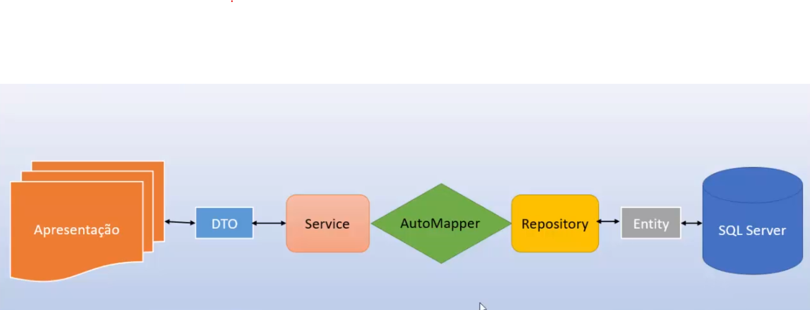

```sql
dotnet ef migrations list --project CleanArchMvc.Infra.Data/ -s CleanArchMvc.Application/
```

```sql
dotnet ef migrations add V1.0.0_DDL_DATABASE_INITIAL --project CleanArchMvc.Infra.Data/ -s CleanArchMvc.Application/
```


```sql
dotnet ef migrations script 0 V1.0.0_DDL_DATABASE_INITIAL -o ./Migrations/Scripts/V1.0.0_DDL_DATABASE_INITIAL.sql --project CleanArchMvc.Infra.Data/ -s CleanArchMvc.Application/
```

```sql
dotnet ef migrations script 0 V1.0.0_DDL_DATABASE_INITIAL -o ./Migrations/Scripts/V1.0.0_DDL_DATABASE_INITIAL.sql --project CleanArchMvc.Infra.Data/ -s CleanArchMvc.Application/
```

```bash
//Modo log view all
dotnet ef... --verbose 
```